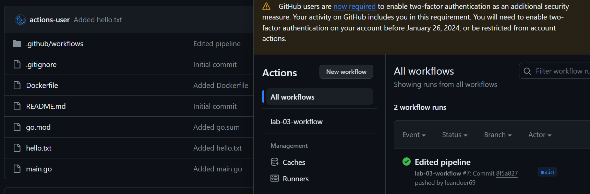

# Лабораторная работа 3
Цель: Сделать, чтобы после пуша в ваш репозиторий автоматически собирался докер образ и результат его сборки сохранялся куда-нибудь. 

Что ж, приступаем!

## Создание docker-образа
Для данной лабораторной работы я решил переделать нашу программу и, соответственно, docker-файл. Теперь мы работаем с простой программой, написанной на Go. Всё, что она делает - создает новый текстовый файлик `hello.txt` и записывает в него какой-то текст:

```Go
package main

import (
	"log"
	"os"
)

func main() {
	file, err := os.Create("hello.txt")
	if err != nil {
		log.Fatal("Creating file error")
	}
	defer file.Close()

	msg := []byte("ТРЕТЬЬЬЬЬЯ ЛАБА????")
	_, err = file.Write(msg)
	if err != nil {
		log.Fatal("Cannot write to file")
	}
}
```

Шикарно, теперь напишем multistage-builds dockerfile, дабы размер получившегося образа был небольшой: 

```
FROM golang:1.21.5 as builder
LABEL authors="Глеб"

WORKDIR /app
COPY go.mod .
COPY main.go .
RUN CGO_ENABLED=0 GOOS=linux GOARCH=amd64 go build -o /app/bin .


FROM scratch as production

COPY --from=builder /app/bin /usr/bin/start

ENTRYPOINT ["usr/bin/start"]
```

В builder'e сначала создается рабочая директория, в нее копируется наш main.go, после чего собирается бинарник со всеми необходимыми настройками. На втором этапе этот бинарник копируется и запускается уже из scratch'a. 

## Подключаем Github Actions
Создадим в нашем репозитории папку `.github/actions`. В нем создаем файлик `pipeline.yaml` со следующим содержанием:
```yaml
name: lab-03-workflow

permissions:
  contents: write

on:
  push:
    branches:
      - main

jobs:
  build-docker-image:
    runs-on: ubuntu-latest
    steps:
      - uses: actions/checkout@v4

      - name: Create and commit hello.txt
        run: docker build -t goapp .

      - name: Starting a container with created image
        run: docker run --name go-container goapp

      - name: Replace file
        run: docker cp go-container:hello.txt $GITHUB_WORKSPACE

      - name: Remove the container
        run: docker rm go-container

      - name: Commit and push file
        run: |
          git config --global user.name "GitHub Actions"
          git config --global user.email "actions@github.com"
          git add hello.txt
          git commit -m "Added hello.txt"
          git push

      - name: Finishing
        run: echo "file was uploaded!"
```
Здесь мы добавляем разрешение на push в репозиторий, объявляем новую job'у, в которой собираем образ, запускаем контейнер с ним, перемещаем созданный файл в рабочее пространство github, для чистоты удаляем контейнер и пушим созданный файл в репозиторий. Сделаем коммит нашего `pipeline.yaml` и проверим:<br>
<br>

Как видим, все прошло успешно и в репозиторий добавился созданный файлик. Чудеса...
